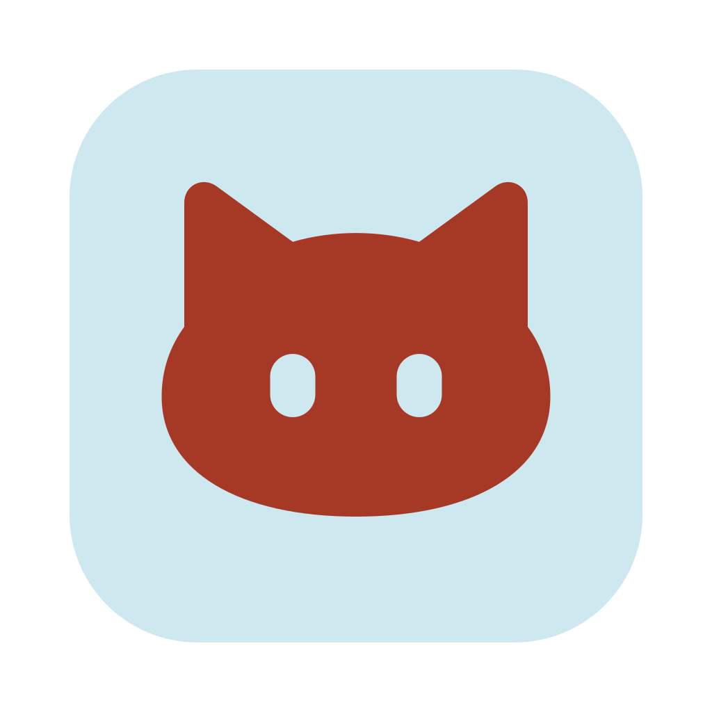
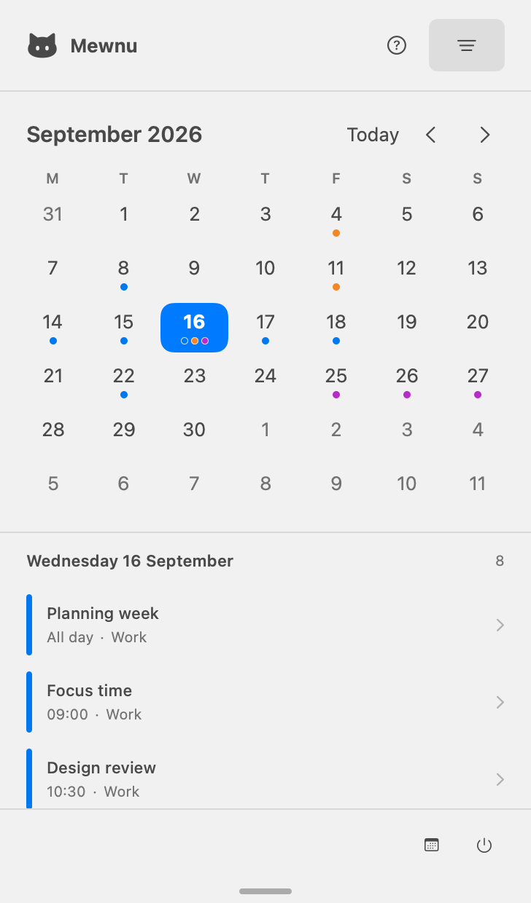
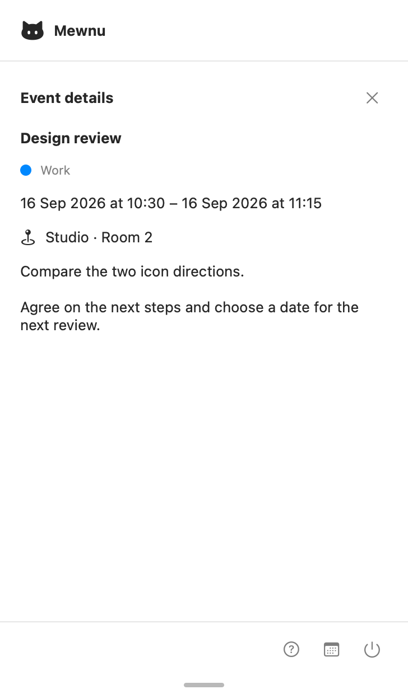
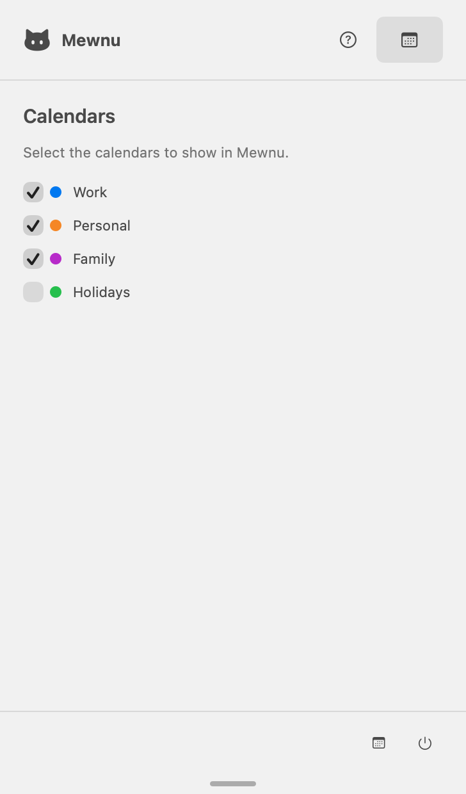
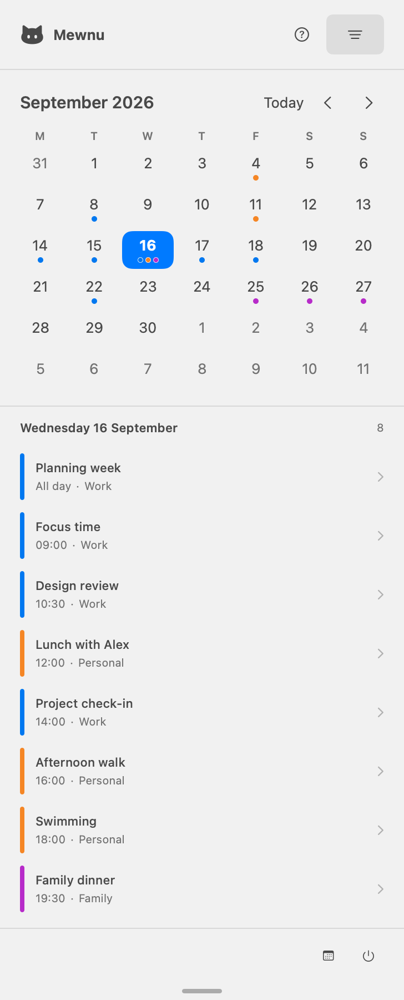
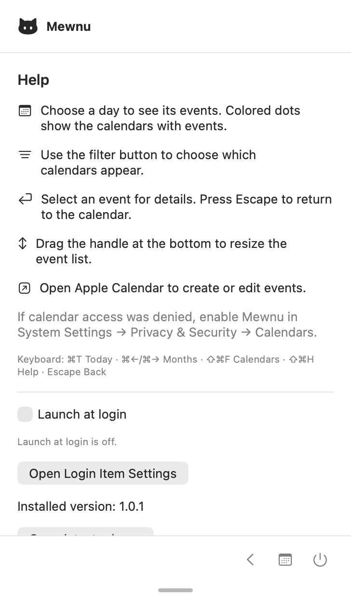
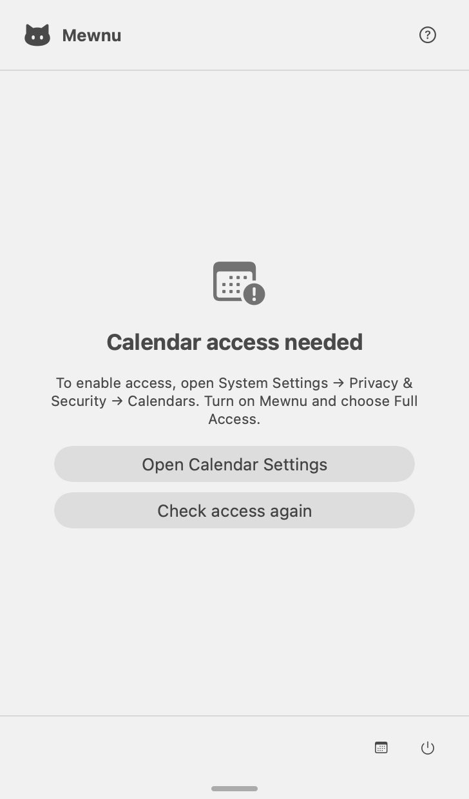

<p align="center">
  
</p>

# Mewnu

**Your Apple Calendar events, right in the macOS menu bar.**

Click the cat to see your month, browse a day's agenda, and read event details without opening a separate calendar window. Mewnu is a small, native, read-only companion to Apple Calendar.

**macOS 26+ · Apple silicon and Intel · English and German · No account or subscription**

[For users](#for-users) · [Screenshots](#screenshots) · [For developers](#for-developers) · [Contributing](CONTRIBUTING.md)

## For users

### What you can do

- **See your month at a glance.** Colored dots show which calendars have events on each day. Select a date to see its agenda, or choose **Today** to return to the current day.
- **Read complete event details.** Select an event to scroll its full title, time, calendar, location, and notes. All-day, overnight, multiday, and timed point events are supported.
- **Choose your calendars.** Use the filter button to show work, personal, family, or other calendars already available in Apple Calendar. Your selection is remembered.
- **Make room for a busy day.** Drag the bottom handle to make the event list taller. Mewnu remembers the window height.
- **Start with your day.** Enable **Launch at login** in Help if you want Mewnu to start when you sign in. macOS manages the setting; it is off until you enable it.
- **Find updates.** Help shows the installed version and opens the latest GitHub release in your browser on request. Updates are downloaded and installed manually.
- **Keep editing in Apple Calendar.** The calendar icon at the bottom opens Apple's app, where you can create or change events. Mewnu itself only reads them.

Mewnu lives in the menu bar: there is no Dock icon, separate main window, or Mewnu account to set up. It follows your system's date, time, and week settings, and provides keyboard controls and VoiceOver labels; interaction verification is described in the [checklist](docs/INTERACTION-VALIDATION.md).

### Screenshots

These native app views use **fictional sample calendars and events** on a fixed date. They contain no personal calendar data. Select an image to view it at full size.

<table>
  <tr>
    <td width="33%" valign="top">
      <strong>Month and daily agenda</strong><br>
      Find a day and see its appointments.<br><br>
      <a href="docs/images/mewnu-overview.png"></a>
    </td>
    <td width="33%" valign="top">
      <strong>Event details</strong><br>
      Read the time, location, and notes.<br><br>
      <a href="docs/images/mewnu-event-details.png"></a>
    </td>
    <td width="33%" valign="top">
      <strong>Calendar filter</strong><br>
      Choose which calendars appear.<br><br>
      <a href="docs/images/mewnu-calendar-filter.png"></a>
    </td>
  </tr>
  <tr>
    <td valign="top">
      <strong>More room for busy days</strong><br>
      Expand the window to see more events.<br><br>
      <a href="docs/images/mewnu-expanded-agenda.png"></a>
    </td>
    <td valign="top">
      <strong>Help inside the app</strong><br>
      Find the main controls and shortcuts.<br><br>
      <a href="docs/images/mewnu-help.png"></a>
    </td>
    <td valign="top">
      <strong>Calendar access</strong><br>
      Restore access when permission is denied.<br><br>
      <a href="docs/images/mewnu-calendar-access.png"></a>
    </td>
  </tr>
</table>

### Download and install

Download the signed app from [GitHub Releases](https://github.com/nimbusline/Mewnu/releases/latest), or [build Mewnu from source](#build-and-run).

To install:

1. Download `Mewnu-vX.Y.Z-macos.dmg` from GitHub Releases.
2. Open the disk image and drag **Mewnu** to **Applications**.
3. Eject the disk image, then open Mewnu from Applications.
4. Look for the cat in your menu bar and allow calendar access when prompted.

Release downloads include a `.sha256` checksum. To verify a download, put both files in the same folder and run the following command, replacing `X.Y.Z` with the release version:

```sh
shasum -a 256 -c Mewnu-vX.Y.Z-macos.dmg.sha256
```

### Updating

Open **Help → Open latest release**, compare the version on GitHub with the installed version shown in Help, and download the newer signed DMG. Quit Mewnu, drag the new app to Applications, confirm replacement, and reopen it. Calendar filters and window height are retained. Mewnu does not check for or install updates in the background.

### Calendar access and privacy

Mewnu reads the calendars already configured in Apple Calendar; you do not sign in to your calendar accounts again. Account setup and synchronization stay with macOS and Apple Calendar.

macOS asks for **Full Access** because EventKit requires that permission to read events. Mewnu never creates, changes, or deletes events. It has no analytics, network service, or event-content storage. Calendar filters and the window height are saved locally.

If access was denied or revoked, open **System Settings → Privacy & Security → Calendars**, enable Mewnu, and select **Full Access**. Return to Mewnu or choose **Check access again**. macOS does not normally repeat the initial permission prompt after a denial.

### Everyday controls

| Action | Control |
| --- | --- |
| Open the calendar | Click the cat in the menu bar |
| Move between months | Use the left and right arrows or **⌘← / ⌘→** |
| Return to the current day | Select **Today** or **⌘T** |
| Show a day's events | Select a date in the month grid |
| Show or hide calendars | Use the filter button in the header or **⇧⌘F** |
| Read an event | Select its row in the agenda |
| Return from details or help | Use the close/back button or **Escape** |
| Resize the agenda | Drag the handle at the bottom of the window |
| Find in-app help | Select **?** in the footer or **⇧⌘H** |
| Create or edit events | Select the calendar icon at the bottom, then edit in Apple Calendar |
| Exit Mewnu | Select the power icon at the bottom of the menu |

If an event seems to be missing, check the selected day and calendar filter, then confirm that it appears in Apple Calendar. If no calendars are available, check the permission settings above.

## For developers

### Requirements

- macOS 26 or newer and **Xcode 27+**, selected as the active developer tools.
- [XcodeGen](https://github.com/yonaskolb/XcodeGen) exactly 2.46.0 to generate the project.
- Python 3 for the coverage check and optional artwork generation.

Mewnu uses SwiftUI, AppKit, and EventKit. It has **no third-party runtime dependencies** and requires no backend or API keys.

### Build and run

```sh
git clone https://github.com/nimbusline/Mewnu.git
cd Mewnu
scripts/install-xcodegen.sh
scripts/generate-project.sh
xcodebuild -project Mewnu.xcodeproj -scheme Mewnu \
  -destination 'platform=macOS' -derivedDataPath build/DerivedData \
  CODE_SIGN_IDENTITY=- CODE_SIGNING_ALLOWED=YES build
open build/DerivedData/Build/Products/Debug/Mewnu.app
```

These commands use ad-hoc signing for local development. You can also open `Mewnu.xcodeproj` in Xcode and select your own development team for automatic signing.

`project.yml` is the source of truth for the checked-in Xcode project. Run `scripts/generate-project.sh` after changing source files or project settings, and include any generated project changes with your contribution.

The installer verifies the pinned upstream archive checksum and includes XcodeGen’s setting presets. The pin and checksum live in `scripts/toolchain/xcodegen.env`. CI runs `scripts/generate-project.sh --check` and rejects changed, deleted, or untracked generated project output; ignored Xcode user state is excluded. To upgrade the tool, review the pin, checksum, regenerated project, and build/test results together. Run `scripts/validate-entitlements.sh` for independent offline XML and plist checks.

### Tests and coverage

Unit tests use fake calendar services. UI tests launch with synthetic sample calendars and do not need access to your personal calendar. Run UI tests one session at a time: multiple runs operate the same macOS menu bar and can interfere with each other.

Use a fresh result directory for each run:

```sh
results_dir="$(mktemp -d /tmp/MewnuTests.XXXXXX)"

xcodebuild -project Mewnu.xcodeproj -scheme Mewnu \
  -destination 'platform=macOS' -enableCodeCoverage YES \
  -resultBundlePath "$results_dir/UnitTests.xcresult" \
  CODE_SIGN_IDENTITY=- CODE_SIGNING_ALLOWED=YES \
  '-only-testing:MewnuTests' test

python3 scripts/check-unit-coverage.py "$results_dir/UnitTests.xcresult"

xcodebuild -project Mewnu.xcodeproj -scheme Mewnu \
  -destination 'platform=macOS' \
  -resultBundlePath "$results_dir/UITests.xcresult" \
  CODE_SIGN_IDENTITY=- CODE_SIGNING_ALLOWED=YES \
  '-only-testing:MewnuUITests' test
```

The coverage gate requires **95% line coverage in each listed core file**: `CalendarMath`, `CalendarText`, `CalendarViewModel`, `CalendarService`, and `EventDisplayText`. This is not a claim of 95% unit coverage for the whole app. Views and application interaction have separate UI and manual checks.

[CI](.github/workflows/ci.yml) also builds a universal Release binary and verifies its `arm64` and `x86_64` slices. Before a release, check real EventKit permissions, synchronization, recurrence exceptions, all-day and overnight events, and large calendars using a test account. See [RELEASING.md](RELEASING.md) for signing, notarization, Gatekeeper, and publication checks.

### Code map

| File or directory | Responsibility |
| --- | --- |
| [`CalendarService.swift`](Mewnu/Core/CalendarService.swift) | Serial EventKit reads and conversion to value snapshots |
| [`CalendarViewModel.swift`](Mewnu/Core/CalendarViewModel.swift) | Permissions, selection, filtering, refreshes, and persisted hidden calendar IDs |
| [`CalendarMath.swift`](Mewnu/Core/CalendarMath.swift) | 42-day month grid and event overlap, including daylight-saving boundaries |
| [`EventDisplayText.swift`](Mewnu/Core/EventDisplayText.swift) | Timed, overnight, multiday, and all-day display text |
| [`MenuWindowSize.swift`](Mewnu/Core/MenuWindowSize.swift) | Saved window height and display bounds |
| [`Views/`](Mewnu/Views/) | Menu, month grid, agenda, filters, help, and event details |
| [`MewnuTests/`](MewnuTests/) / [`MewnuUITests/`](MewnuUITests/) | Unit tests and app interaction tests |
| [`project.yml`](project.yml) | XcodeGen project definition |

Keep EventKit objects out of SwiftUI views. Event end dates are exclusive; use `Calendar` day boundaries instead of fixed 86,400-second arithmetic. Permission revocation clears displayed data, while a transient fetch failure retains the last successful data for the same month.

The [architecture decision records](docs/adr/README.md) explain the product, data, UI, testing, and release choices. Their [implementation references and validation guide](docs/ARCHITECTURE-REFERENCES.md) connect these decisions to code, tests, and verification requirements. The [implementation guide](docs/IMPLEMENTATION.md) defines application behavior and acceptance criteria.

### Screenshots and artwork

Regenerate the six README screenshots on macOS with Xcode selected:

```sh
scripts/capture-screenshots.sh
```

The script renders the actual SwiftUI views in a separate documentation executable with a fixed date and fictional data. It does not launch the production app or read EventKit. See [the screenshot guide](docs/SCREENSHOTS.md) for output files and interactive demo options.

The **Eis & Rost** artwork uses ice blue `#CEE8F0` and rust red `#A63925`. The menu bar and app header share a vector template that follows the system foreground color. Editable SVG originals and regeneration instructions are in [`Brand/`](Brand/README.md). The source code and artwork share the MIT license.

### Contributions and releases

Follow [CONTRIBUTING.md](CONTRIBUTING.md), keep English and German strings synchronized, and check keyboard navigation, VoiceOver labels, and resizing when changing the UI.

Use the [issue templates](https://github.com/nimbusline/Mewnu/issues/new/choose) for bugs and feature requests. Report security concerns privately as described in [SECURITY.md](SECURITY.md). The [Code of Conduct](CODE_OF_CONDUCT.md) applies to participation.

Release tags must match `MARKETING_VERSION` in `project.yml`. The release workflow tests, builds, signs, notarizes, and packages a DMG plus its SHA-256 checksum. Local build success alone does not verify a release; follow [RELEASING.md](RELEASING.md).

Licensed under [MIT](LICENSE).
